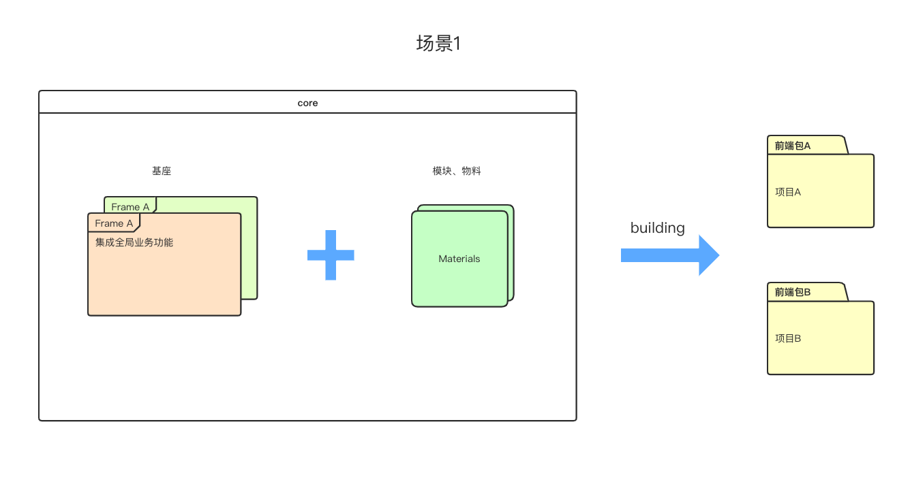
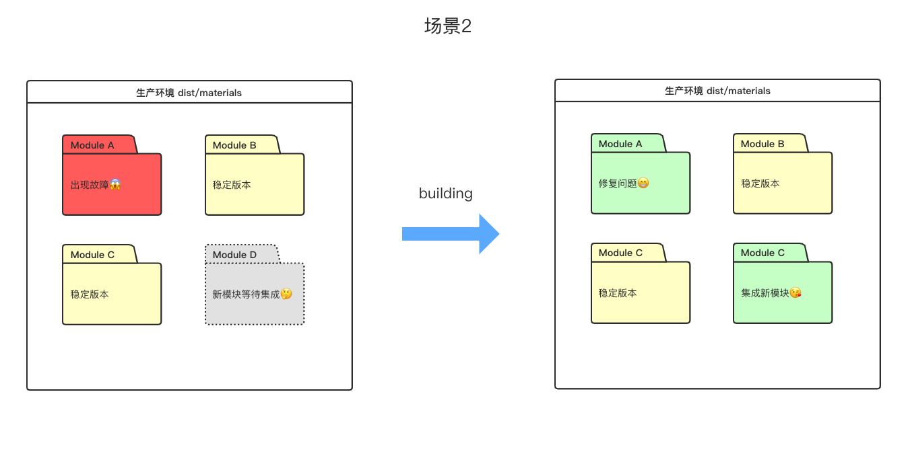

# 基于vue + webpack的简化版微前端探索与实践

<a href="http://www.nextprops.com">online-demo</a>

## 构想
为toB业务线,提供一个简化版的微前端解决方案.通过基座+模块的灵活组合方式,根据特定业务形态下的需求,产出前端工程.
(仅供学习交流)

## 特点
基座 + 业务模块的灵活组合
<p align="center">
  
</p>
<br/>
<br/>
生产环境模块热插拔
<p align="center">
  
</p>

## 原理
1. `umd`方式打包模块
2. `loadJS`加载模块

### 开发环境

安装依赖

```bash
yarn config set registry https://registry.npm.taobao.org -g
yarn
```

构建第三方依赖

```bash
npm run dll
```

运行

```bash
npm run dev
```

### 生产环境

构建第三方依赖

```bash
npm run dll
```

```bash
npm run build
```


#### 单独打包架构

```
npm run core
```

#### 单独打包基座

```bash
npm run frame --name="xxx"
```

#### 单独打包业务模块/物料

```bash
npm run material --name="xxx"
```

通过dist/map.js中的文件名加载对应的模块,需要对应.